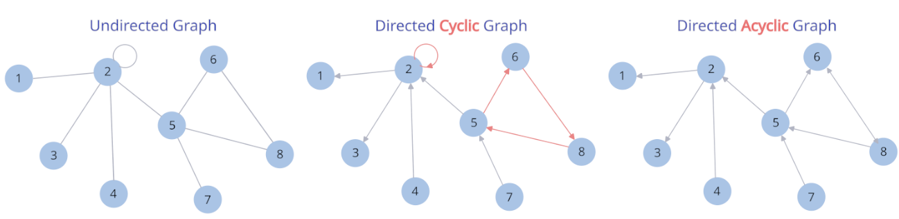
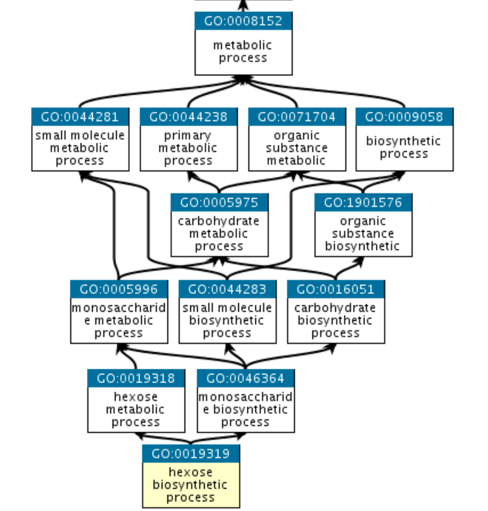

# Exploratory Data Analysis (EDA): Gene Ontology (GO) Graph

Many of the **complex systems** around us have **entities** connected by their **relations** in a **network**:

- Friends are connected by friendships
- Neurons are connected by synapses
- Websites are connected by hyperlinks
- Addresses are connected by roads, streets, walking paths
- Proteins are connected by molecular interactions, pathways

<figure>

</figure>

<b>Figure 1.</b>Protein-Protein Interaction (PPI) Networks of <i>Saccharomyces cerevisiae</i> (left) and <i>Homo sapiens</i> (right). Each node represents one protein, and the edges indicate the proteins that interact. Both interactomes (i.e. <b>proteins connected by their molecular interactions organized in a network</b>) were obtained using yeast two-hybrid (Y2H) technique (Jeong et al., 2001 411(3), Rual et al. Nature 2005: 437(4) - Macmillan Publishers Ltd.)

Networks are an organizing principle of Nature. The basic idea to abstract real-world networks with their entities and relations into computationally tractable **data structures** goes as follows:
- **entities** are represented by **nodes**, also known as **vertices**
- **relations** are represented by **links**, also known as **edges**
- **nodes** are connected by **edges** in many possible ways in a **graph**

>We will use ***networks*** and ***graphs***  interchangebly in the notebook, and **nodes** and **edges** for entities and relations, respectively.

<figure>

</figure>

<b>Figure 2.</b> Undirected Graph, Directed Cyclic Graph (DCG) and  Directed Acyclic Graph (DAG). In undirected graphs, the edges are bidirectional and equivalent, while in directed graphs  edges have a direction of the relationship that are depicted as arrows departing from a node and arriving at another node (the node can be connected to itself, what we call <i>self-loop</i>). A directed graph is cyclic when we can trace a path from one node and return to the same node, as indicated by the <i>red arrows</i>. If the graph has at least one cyclic path, which can be a self-loop, the graph is cyclic. In directed acyclic graphs, such closed cycles do not exist. There are also Multigraphs with multiple edges connecting the same two nodes (<i> parallel edges</i>). This is the case for the Gene Ontology graph.

Real-world networks can be quite large and complex, with thousands to millions of entities (e.g. social networks, PPI networks, internet addresses, etc). To analyze such large networks, we can focus on specific features and ignore the others. All examples above can be abstracted into *entities* (users, neurons, websites, ...) represented by nodes and connected by edges denoting their *relations* (friendships, synapses, links, ...). The differences of these networks are related to the size and node/edge composition, but still, the basic building blocks and the math used to analyze them are the same. Thus, **networks follow the same organizing principles and can be analyzed using similar tools**. 

Data scientists will be dealing with graph data structure, probably, a great deal. By using data structured in graphs, we can take advantage of the relational structure to make better predictions about the behavior of the network over time (predict new nodes, new edges, or new graphs). Graph Neural Network (GNN) is a 'hot' subfield of machine learning and the new frontier of Deep Learning. [Graph Theory](https://en.wikipedia.org/wiki/Graph_theory#:~:text=In%20mathematics%2C%20graph%20theory%20is,also%20called%20links%20or%20lines) and [Geometric Deep Learning](https://arxiv.org/abs/2104.13478) aim to organize networks' principles by creating tools and approaches to construct and to analyze graphs, as well as to predict the appearance of new entities or relations in the graph. For machine learning (ML) applications, frameworks such as [Deep Graph Library (DGL)](https://www.dgl.ai) and [PyTorch Geometric (PyG)](https://pyg.org) are packed with useful classes and functions to create and manipulate graphs easily.

>DGL and PyG frameworks also provide out-of-the-box algorithms for learning on graphs (e.g. Graph Convolutional Networks (GNNs)), bearing the idea that using graphs for prediction tasks can be way more efficient than traditional deep learning algorithms. The topological information encoded in the graph structure tells the algorithm what is essential to look at during training. The topological information and the attributes of nodes/edges are embedded into a vector and used for prediction.

##***Gene Ontology Directed Acyclic Multigraph***
The Gene Ontology (GO) terms are organized in a hierarchical [directed acyclic multigraph](https://networkx.org/documentation/stable/reference/classes/multidigraph.html). Each GO terms (e.g. GO:0000001) is a node and the edges represent the relationship between them (e.g. *"is_a"*, *"regulates"*). As a directed graph, we have ancestors and descendants nodes, which are refered as *parents* and *children* nodes in the GO graph. Parents are closer to the root of the GO graph, and children terms are more specific regarding the annotation. 

Unlike taxonomy trees, where child entities have one parent, a child GO term can have more than one parent. For example: a chloroplast 'is an' organele and 'is part of' the cytoplasm. The GO graph does not have a single root but three separated by the three major ontologies: Cellular Component (CC), Molecular Function (MF) and Biological Process (BP). These roots are  *is_a* disjoint because there is no such relation between among these three ancestors' ontologies.

<figure>

</figure>

<b>Figure 3.</b> The hexose biosynthetic process. Biosynthetic process is a subtype of metabolic process and hexose is a subtype of monosaccharide. (Source: <a href="https://geneontology.org"><i>Gene Ontology Consortium</i></a>)

Here we perform an Exploratory Data Analysis (EDA) of the GO graph. The EDA presented in this notebook was motivated by the [Critical Assessment of Functional Annotation (CAFA)](https://genomebiology.biomedcentral.com/articles/10.1186/s13059-019-1835-8) competition, which is hosted by CAFA innitiative to engage the data science community into finding new insights on how to improve the prediction of protein function.

Before that, we will walk through some basic operations on graphs:
- Create a graph
- Add nodes
- Add edges
- Analyze graph and nodes' degrees
- Add nodes and edges attributes
- Analyze graph connectivity
- Visualize a graph

To explore the GO graph, we will:
- Read and parse the [GO graph](https://geneontology.org/docs/download-ontology) file
- Check graph type
- Visualize nodes' degree distribution
- Extract and analyze nodes' attributes
- Split the GO graph
- Plot sub-graphs
- Create a dataframe with nodes' attributes